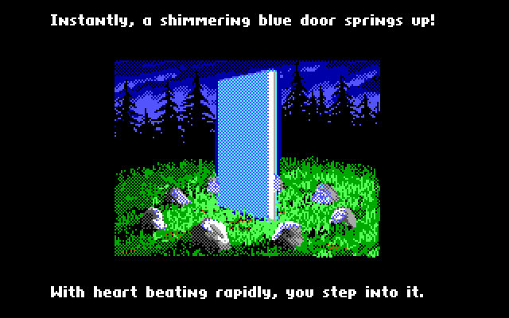

# Moongate.js

*image courtesy of the [Ultima Codex wiki](https://wiki.ultimacodex.com/wiki/Moongate)*

- A JavaScript text character tile-based engine for creating role-playing and roguelike games!
- A doorway or portal to a new quest or land of adventures!
- The aim is to create a collection of classes, objects, structs and/or enums that make putting together
some gamedev stuff for 2D projects.
- Your own *Moongate* getting you to your gameplay faster.

NOTE: THIS IS HEAVILY A WORK IN PROGRESS. PULL REQUESTS WILL DEFINITELY BE LOOKED AT.

## Use in your own Projects

- `npm install moongate.js`

## Development Install

- `git clone git@github.com:erikyuzwa/moongate.js.git`
- `cd moongate.js`
- `npm run dev`
- `http://localhost:5173`

## Production Build

- `npm run build`

## Features

- Aimed at 2D games
- Three rendering engines available: WebGL, 2d canvas and DOM
- colored characters
- colored character backgrounds
- simple keyboard input handling
- includes DejaVu Sans Mono font support

## Videos

- TODO

## Roadmap

- TODO

## References and Inspiration

- [unicodetiles](https://github.com/tapio/unicodetiles.js)
- [FlashPunk](http://useflashpunk.net/)
- [SDL2](https://libsdl.org/)

## License

MIT License

Copyright (c) 2023 Erik Yuzwa

Permission is hereby granted, free of charge, to any person obtaining a copy
of this software and associated documentation files (the "Software"), to deal
in the Software without restriction, including without limitation the rights
to use, copy, modify, merge, publish, distribute, sublicense, and/or sell
copies of the Software, and to permit persons to whom the Software is
furnished to do so, subject to the following conditions:

The above copyright notice and this permission notice shall be included in all
copies or substantial portions of the Software.

THE SOFTWARE IS PROVIDED "AS IS", WITHOUT WARRANTY OF ANY KIND, EXPRESS OR
IMPLIED, INCLUDING BUT NOT LIMITED TO THE WARRANTIES OF MERCHANTABILITY,
FITNESS FOR A PARTICULAR PURPOSE AND NONINFRINGEMENT. IN NO EVENT SHALL THE
AUTHORS OR COPYRIGHT HOLDERS BE LIABLE FOR ANY CLAIM, DAMAGES OR OTHER
LIABILITY, WHETHER IN AN ACTION OF CONTRACT, TORT OR OTHERWISE, ARISING FROM,
OUT OF OR IN CONNECTION WITH THE SOFTWARE OR THE USE OR OTHER DEALINGS IN THE
SOFTWARE.
